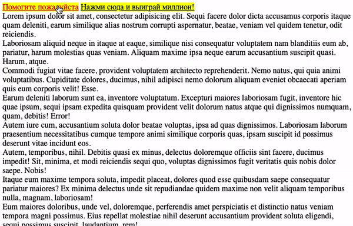

### Всплывающая подсказка

Реализована всплывающая подсказка для элементов. Появляется
после клика на элементе.

### Механизм действия

1. Подсказка появляется на основе положения текста.
2. Тултип появляется при клике на элемент.
3. В один момент времени показываться только одна подсказка.
